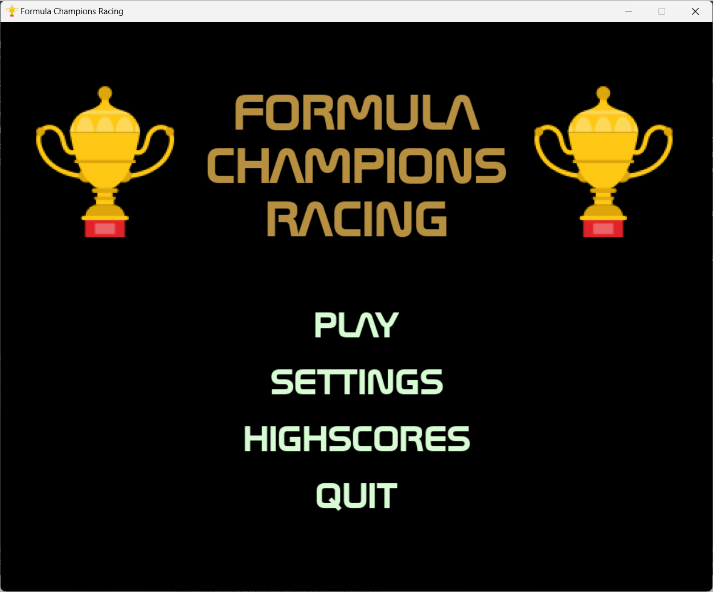
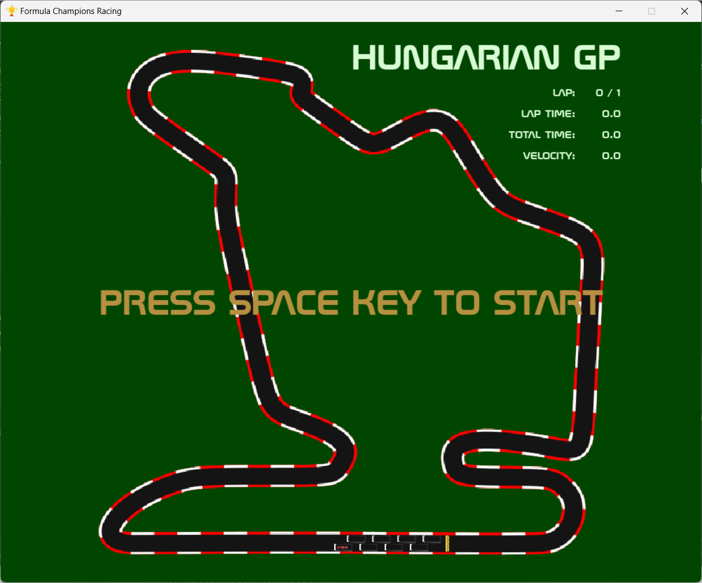
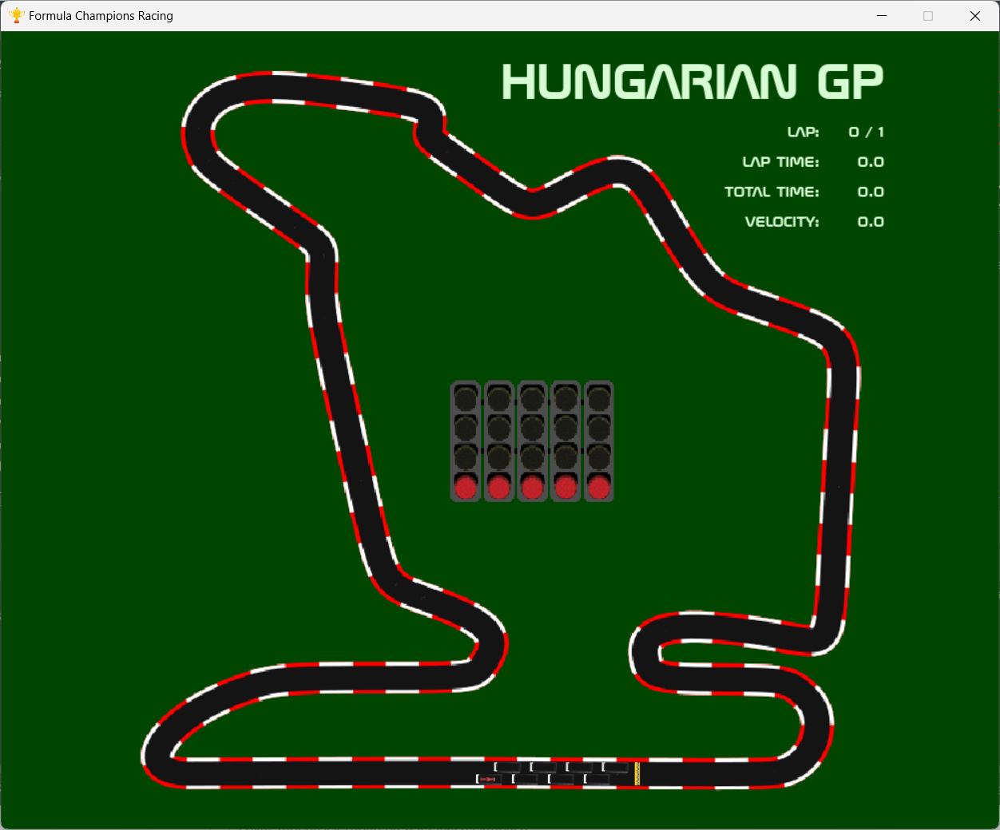
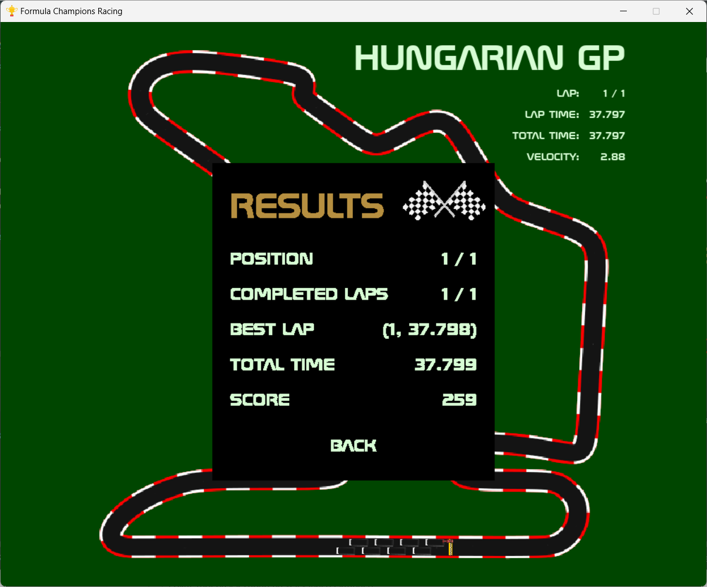
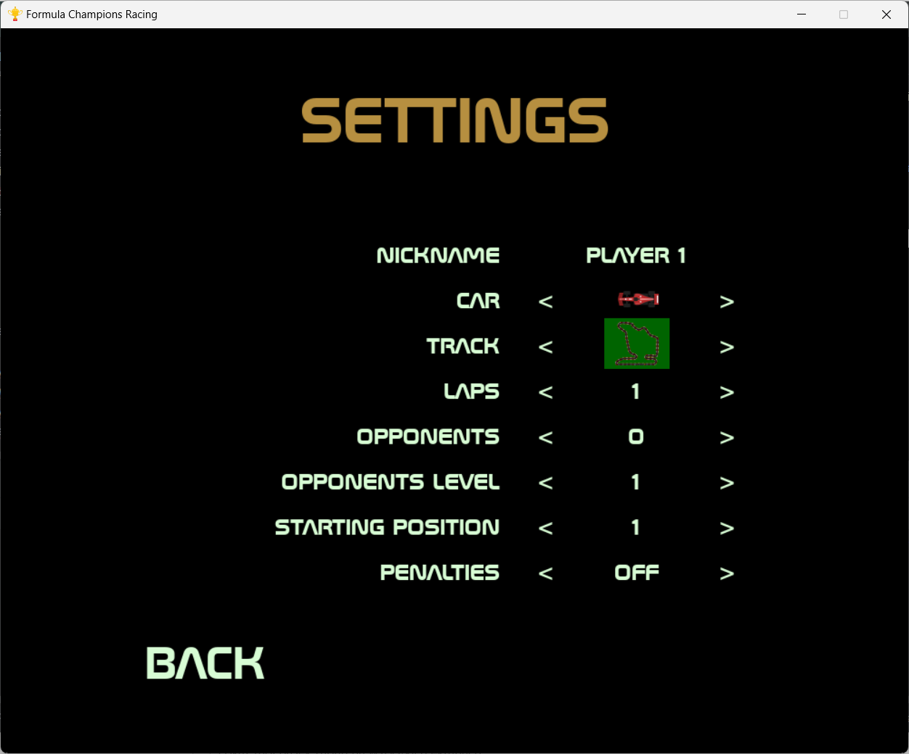
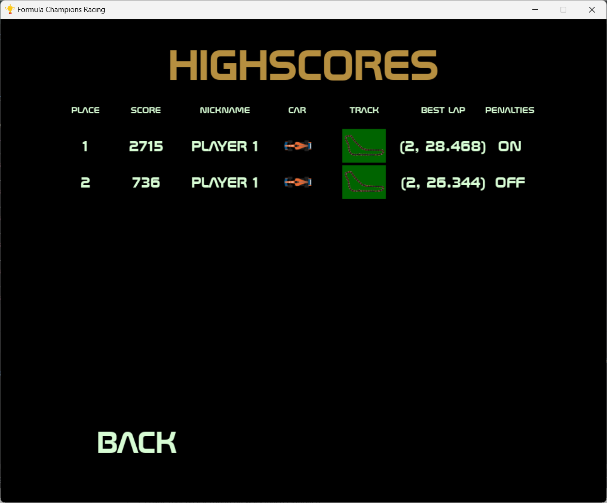
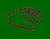
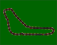
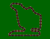

# PROJEKT GRY WYŚCIGOWEJ - *FORMULA CHAMPIONS RACING*

## OPIS GRY

- *FORMULA CHAMPIONS RACING* to jednoosobowa gra wyścigowa przypominająca wyścigi Formuły 1.
 Gracz może rozpocząć grę z ustawieniami domyślnymi (kliknięcie *PLAY*) lub wybrać opcje po przejściu na ekran ustawień (*SETTINGS*).
W menu ustawień gracz może wpisać swoją ksywkę (*NICKNAME*), wybrać bolid (w grze dostępnych jest osiem różnych modeli, które różnią się osiągami - zobacz sekcję [punktowanie](#punktowanie)),
tor, na którym chce się ścigać oraz ustawienia sesji:
  - liczba okrążeń,
  - liczba i poziom przeciwników,
  - pozycja startowa (do wyboru jest konkretne miejsce, bądź pozycja losowa)
  - przyznawanie kar:
    - kara za ścinanie zakrętów
    - kara za zbyt długie przebywanie poza torem
- W trakcie wyścigu mierzony jest czas całkowity wyścigu, jak również czasy poszczególnych okrążeń.
Po przejechaniu linii mety graczowi przyznawane są punkty w zależności od kilku czynników (zobacz sekcję [punktowanie](#punktowanie)):
  - wybranego bolidu (im słabszy bolid, tym większy możliwy do uzyskania wynik)
  - wybranego toru
  - zajętego miejsca (im wyższe, tym wyższy wynik)
  - wybranych przeciwników i ich poziomu (im wyższy poziom, tym więcej punktów można uzyskać)
  - sumaryczny czas wyścigu (im większy, tym niższy będzie wynik)
  - włączenia opcji przyznawania kar
- Z poziomu menu głównego istnieje możliwość wyświetlenia tablicy wyników, która zawiera 
maksymalnie 8 najlepszych wyników.

## WYMAGANIA WSTĘPNE

Aby uruchomić grę należy mieć zainstalowany python w wersji przynajmniej 3.12.
Po pobraniu kodu źródłowego lub sklonowaniu repozytorium z grą zalecane jest utworzenie wirtualnego środowiska
za pomocą polecenia `python -m venv .venv`, a następnie aktywowanie tego środowiska za pomocą odpowiedniego polecenia
(zobacz [uruchomienie wirtualnego środowiska](https://docs.python.org/3/library/venv.html#how-venvs-work)).
Po aktywacji wirtualnego środowiska należy zainstalować pakiety wymagane do działania gry za pomocą polecenia
`python -m pip install -r requirements.txt`. Listę pakietów można podejrzeć przeglądając plik [requirements.txt](requirements.txt)

## ROZGRYWKA

- ### MENU GŁÓWNE

Po menu poruszamy się za pomocą myszki. Po najechaniu na przyciski zmienia się kolor ich wyświetlania.
Przyciski dostępne w menu głównym:

- *PLAY* - rozpoczyna nową grę z ustawieniami domyślnymi (zobacz sekcję [*GRA*](#gra))
- *SETTINGS* - pozwala na wybór ustawień rozgrywki (zobacz sekcję [*USTAWIENIA*](#ustawienia))
- *HIGHSCORES* - wyświetla tablicę 8 najlepszych wyników (zobacz sekcję [*NAJLEPSZE WYNIKI*](#najlepsze-wyniki))
- *QUIT* - zakończenie gry



Zakończenie działania gry jest możliwe na trzy sposoby:

1. naciśnięcie za pomocą myszy klawisza *X*, który zamyka okno programu
2. naciśnięcie za pomocą myszy przycisku *QUIT*
3. wciśnięcie klawisza *ESCAPE*

- ### GRA

Po wybraniu opcji *PLAY* z menu głównego wyświetlana jest właściwa gra.



Aby rozpocząć grę należy nacisnąć klawisz *SPACJA*. Po jej naciśnięciu wyświetla się obraz z lapmami startowymi i następuje odliczanie do wyścigu.



W prawym górnym rogu ekranu wyświetla się nazwa aktualnego GP oraz dane wyścigowe (liczba okrążeń, czas okrążenia i czas sumaryczny wyścigu (oba wyrażone w sekundach z dokładnością do 0.001 s) oraz prędkość gracza w pikselach / s).

W grze zaimplementowano mechanizm zapobiegający wyjazdowi poza ekran - gdy gracz przekroczy granicę
ekranu gry, jego bolid jest przenoszony na pozycję resetowania, ustaloną dla każdego z dostępnych torów niezależnie.

Zakończenie wyścigu następuje w chwili przecięcia linii mety po przejechaniu wybranej wcześniej liczby okrążeń.
W momencie finiszowania obliczany jest wynik oraz wyświetlany panel podsumowujący zakończony właśnie wyścig.



Aby przejść do menu głównego należy kliknąć przycisk *BACK* lub nacisnąć klawisz *ESCAPE*.

W każdym momencie można przerwać wyścig i powrócić do głównego menu. Służy do tego klawisz *ESCAPE*.

#### STEROWANIE

Do sterowania bolidem służą następujące klawisze:

- w: przyspieszanie
- s: hamowanie, po całkowitym zatrzymaniu jazda do tylu
- a: skręt w lewo
- d: skręt w prawo

**UWAGA** Po całkowitym zatrzymaniu bolidu nie możliwe jest skręcanie - aby móc skręcić należy
posłużyć się przyciskiem *w* lub *s*, aby rozpędzić bolid, a następnie używać klawiszy *a* lub *d*, aby skręcać.

- ### USTAWIENIA

Po menu poruszamy się za pomocą myszki. Ekran ustawień zawiera etykiety oraz przyciski
służące do wyboru poszczególnych opcji, a także pole tekstowe do wpisania swojej ksywki (domyślna wartość *PLAYER 1*
\- wprowadzić można maksymalnie 10 znaków).
\
Zakresy dostępnych opcji:

- *CAR* - 8 bolidów
- *TRACK* - 3 tory
- *LAPS* - od 1 do 10
- *OPPONENTS* - od 0 do 7
- *OPPONENTS LEVEL* - od 1 do 3
- *STARTING POSITION* - od 1 do 8 oraz opcja losowa - *RANDOM*
- *PENALTIES* - *OFF* / *ON* - włączenie / wyłączenie przyznawania kar za ścinanie zakrętów oraz długie pozostawanie poza torem

Po najechaniu na przyciski zmienia się kolor ich wyświetlania.
Wygląd menu opcji:



Na dole po lewej stronie ekranu znajduje się przycisk *BACK*, który służy do powrotu
do menu głównego (funkcję powrotu do poprzedniego menu można również zrealizować poprzez
naciśnięcie klawisza *ESCAPE*)

- ### NAJLEPSZE WYNIKI

Na ekranie z najlepszymi wynikami wyświetlanych jest maksymalnie 8 najlepszych wyników
uzyskanych z rozegranych gier. Przykładowy ekran najlepszych wyników przedstawiono poniżej.



Po zakończeniu wyścigu, jego wynik wraz z danymi o wybranym bolidzie, torze, najlepszym okrążeniu oraz
informacja czy wybrano przyznawanie kar, zapisywany jest do pliku *scores.csv*. Następnie dane są odczytywane
i użytkownikowi zostaje wyświetlonych maksymalnie osiem najlepszych wyników na ekranie.

#### PUNKTOWANIE

Przyznawanie punktów uwzględnia następujące zmienne:

- współczynnik związany z bolidami:
\
 współczynnik szybkości wynosi 0.96
\
 współczynnik szybkości wynosi 0.96
\
 współczynnik szybkości wynosi 1.0
\
 współczynnik szybkości wynosi 0.93
\
 współczynnik szybkości wynosi 0.98
\
 współczynnik szybkości wynosi 0.9
\
 współczynnik szybkości wynosi 0.91
\
 współczynnik szybkości wynosi 0.93
- współczynnik związany z torem:
\
 współczynnik wyniku wynosi 1.0
\
 współczynnik wyniku wynosi 0.96
\
 współczynnik wyniku wynosi 0.98
- współczynnik związany z poziomem przeciwników:
  - poziom 1: współczynnik wyniku wynosi 0.6
  - poziom 2: współczynnik wyniku wynosi 0.8
  - poziom 3: współczynnik wyniku wynosi 1.0
- współczynnik związany z pozycją startową:
  - miejsca 1 - 4: współczynnik wyniku wynosi 0.8
  - miejsca 5 - 8: współczynnik wyniku wynosi 1.0
- współczynnik związany z miejscem na mecie:
  - I: współczynnik wyniku wynosi 1.0
  - II: współczynnik wyniku wynosi 0.9
  - III: współczynnik wyniku wynosi 0.8
  - IV: współczynnik wyniku wynosi 0.7
  - V: współczynnik wyniku wynosi 0.6
  - VI: współczynnik wyniku wynosi 0.5
  - VII: współczynnik wyniku wynosi 0.4
  - VIII: współczynnik wyniku wynosi 0.3
\
**UWAGA** W przypadku nie wybrania przeciwników współczynnik wyniku wynosi 0.5
- współczynnik związany z czasem sumarycznym wyścigu:
  - mniejszy niż 45 s pomnożone przez liczbę okrążeń: współczynnik wyniku wynosi 1.0
  - mniejszy niż 60 s pomnożone przez liczbę okrążeń: współczynnik wyniku wynosi 0.75
  - czas większy niż 60 s pomnożone przez liczbę okrążeń: współczynnik wyniku wynosi 0.5
- współczynnik związany z przyznawaniem kar:
  - włączone: współczynnik wyniku wynosi 1.0
  - wyłączone: współczynnik wyniku wynosi 0.5

Końcowy wynik przeliczany jest wg schematu:

```python
score = round(
    1000
    * 60
    * 4
    * track_factor
    * opponents_level_factor
    * starting_position_factor
    * final_position_factor
    * total_time_factor
    * penalties_factor
    * self.settings.selected_laps
    / car_factor
    / self.game_total_time
    / 3
)
```

## Wersja 0.1

# Życzę udanej zabawy!